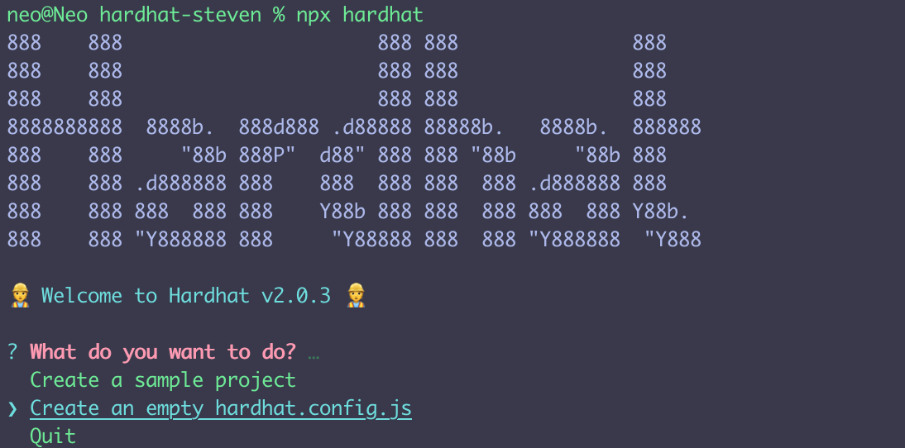

# Deploy smart contract using Hardhat

In this article, You’ll learn how to deploy a smart contract which interacts with Chainlink Using [Hardhat](https://hardhat.org/) (formerly known as Builder). The source of this article can be found in this Github [repo](https://github.com/steven1227/hardhat-deploy). To complete this tutorial, you need knowledge of Javascript and have used [npm](https://www.npmjs.com/) before. Although there is no prerequisite of blockchain or solidity programming experience for you, it would be better if you understand what [Smart contract](https://cointelegraph.com/ethereum-for-beginners/what-are-smart-contracts-guide-for-beginners) is and what is [Chainlink](https://chain.link/).

## Environment setup

First of all, you have to create an empty npm project, and then install the Hardhat

```
 npm init
 npm install --save-dev hardhat
```

Once you install the Hardhat successfully，create your Hardhat project with running `npx hardhat` in your project folder:

```
npx hardhat
```

Here in this article, we are going to create an empty project which let you learn how to use Hardhat from scratch. You can also try to use example project which includes some example tasks and files.



In addition to the `hardhat` dependency, we will use some other useful tools which will be explained later. Now you can install them with

```
npm install --save-dev @nomiclabs/hardhat-waffle ethereum-waffle chai @nomiclabs/hardhat-ethers ethers
```

## Example contract

Now, Let us create a new folder called `contracts`. In the folder, we create our first solidity file which use Chainlink internally:

```javascript
pragma solidity ^0.7.3;

import "@chainlink/contracts/src/v0.6/interfaces/AggregatorV3Interface.sol";

contract PriceConsumer {
    AggregatorV3Interface internal priceFeed;

  	/**
     * Network: Kovan
     * Aggregator: ETH/USD
     * Address: 0x9326BFA02ADD2366b30bacB125260Af641031331
     */
    constructor() public {
        priceFeed = AggregatorV3Interface(
            0x9326BFA02ADD2366b30bacB125260Af641031331
        );
    }

    /**
     * Returns the latest price
     */
    function getLatestPrice() public view returns (int256) {
        (
            uint80 roundID,
            int256 price,
            uint256 startedAt,
            uint256 timeStamp,
            uint80 answeredInRound
        ) = priceFeed.latestRoundData();
        return price;
    }
}

```

Although this article is not a Solitidy tutorial or a guide to use Chainlink, you should know this smart contract defines a function `getLastPrice` which get the information about latests price date from Chainlink PriceFeed. The detail of using Chainlink price feed can be found [here](https://docs.chain.link/docs/get-the-latest-price).

Before we can compile this contract, we have to install the @chainlink/contracts dependency

```
npm install @chainlink/contracts --save
```

After that, we can try to compile our smart contract with `hardhat`:

```
npx hardhat compile
```

Now the hardhat will help us compile this solidity smart contract. With some warnings, the terminal will displays `compilation finished successfully` and you can see there is an new `artifacts` folder in your project.

## Deploy your contract

Once you have done the steps above, the last and the most important step is to deploy the smart contract to a live network. When using Ethereum, you can compile and test your smart contract locally with tools like Truffle or Hardhat. However, if you want everyone in the world to have access to your smart contract or Dapp, you have to deploy it to a public blockchain network. In this article, we are going to learn how to deploy the Kovan testnet. The process of deploying to mainnet is same except you have to spend your expensive ETH.

Now we create a new directory called `scripts`. In side it , we create our script with filename `deploy.js`:

```javascript
async function main() {
  console.log("Getting artifacts");
  const PriceConsumerFactory = await ethers.getContractFactory("PriceConsumer");
  console.log("Deploying");
  const priceConsumer = await PriceConsumerFactory.deploy();
  console.log("priceConsumer deployed to: ", priceConsumer.address);
}

main()
  .then(() => process.exit(0))
  .catch((error) => {
    console.error(error);
    process.exit(1);
  });
```

In this script, the `ethers` variable is available in the global scope. A `ContractFactory` in ethers.js is an abstraction used to deploy new smart contracts. Here the `PriceConsumerFactory` is a factory of our smart contract. After calling the `deploy` method, we will get the instance of the deployed smart contract. We can console the `address` of this `priceConsumer` instance to view the contract address it deployed to the Kovan testnet.

Before we are going to deploy it to the Kovan testnet, we need to configure the right network. Open the `hardhat.config.js` , we need to define the network variable with the Kovan network URL and the private key that used to deploy the contract:

```javascript
require("@nomiclabs/hardhat-waffle");

const INFURA_PROJECT_ID = "Your infura project ID";

const KOVAN_PRIVATE_KEY = "Your private key";

module.exports = {
  solidity: "0.7.3",
  networks: {
    kovan: {
      url: `https://kovan.infura.io/v3/${INFURA_PROJECT_ID}`,
      accounts: [`0x${KOVAN_PRIVATE_KEY}`],
    },
  },
};
```

Here the url we are pointing should be a ethereum node which is running in the kovan testenet or any gateway that in the kovan. What we are using is [infura](https://infura.io/) here.To have the `INFURA_PROJECT_ID` , you can go to infura and create a new project and copy your own project ID over there.

Deploying the ehereum smart contract needs an account and it costs some ETH. In order to get an account, you can create a new account in [MetaMask](`https://metamask.io/`) and then export your private key from Metamask, open it and go to Account Details > Export Private Key. Be aware of never putting real Ether into these testing accounts. After you get account, you can get 1 test Ether from [faucet](https://faucet.kovan.network/).

When everything gets ready, we can run the deploy script:

```
npx hardhat run scripts/deploy.js --network kovan
```

In the terminal, you will see the deployed contract address:


## Conclusion

In this article, you learned how to deploy a smart contract that uses Chainlink price feed using Hardhat. Hardhat is a development environment to compile, deploy, test, and debug your Ethereum smart contract. You can learn more details and references from [here](https://hardhat.org/getting-started/#overview). Thanks for reading, and you can get more updates about Chainlink at https://blog.chain.link/.
